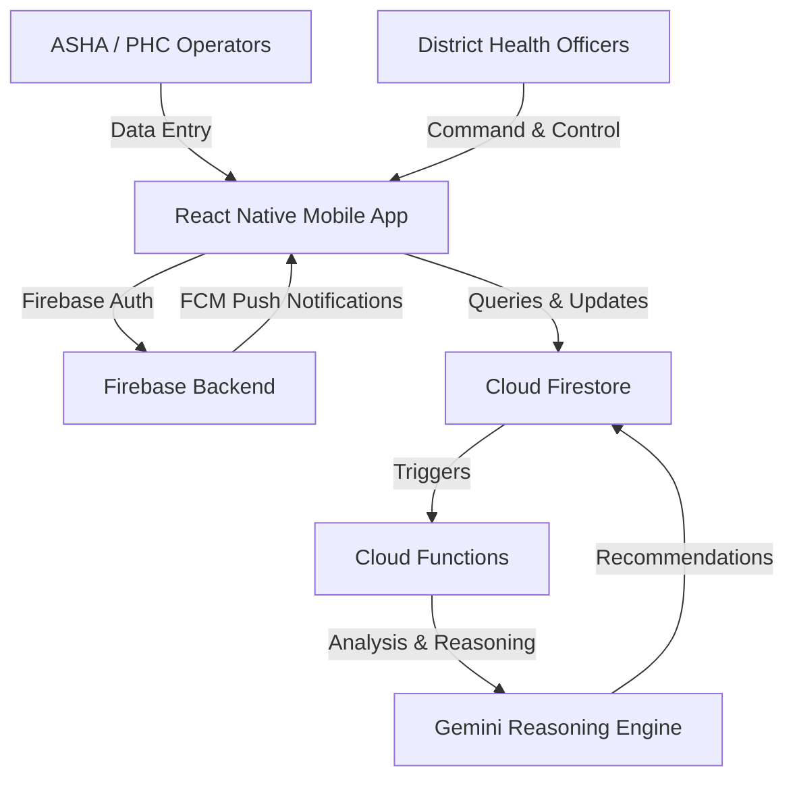

# JanArogya Netra — District Health Intelligence Command Center

> **Tagline:** The Eye of Public Healthcare
> **Track:** Smart Health (Google Cloud Build with AI — Code for Communities Hackathon)

JanArogya Netra is an AI-powered District Health Intelligence Command Center that monitors Public Health Centers (PHCs) and Community Health Centers (CHCs) in real-time. By utilizing predictive and prescriptive intelligence, it recommends medicine redistribution and alerts authorities to operational abnormalities before they turn into healthcare crises.

---

## 🏗️ Architecture



---

## 📁 Folder Structure

```
├── app/                  # Expo Router navigation screens
│   ├── (tabs)/           # Tab-based screens (Situation Room, District Map, PHCs, Notifications, Profile, Settings)
│   ├── _layout.tsx       # Root layout defining navigation stack & query providers
│   ├── index.tsx         # Splash screen with auto-redirection
│   └── login.tsx         # Login portal
├── assets/               # Splash screen, icons, and image assets
├── components/           # Reusable UI elements
│   ├── common/           # Shared layout components (Header, etc.)
│   └── ui/               # Core design elements (Buttons, inputs, etc.)
├── config/               # Application-level configurations
├── constants/            # Style variables, assets, & static constants
├── docs/                 # Hackathon documentation and references
├── features/             # Feature-first modules
│   ├── auth/             # Login, Session and Registration logic
│   ├── dashboard/        # DHO metrics & status summaries
│   ├── situation-room/   # Active situations & alerts queue
│   ├── district-map/     # Google Maps geolocation & mapping
│   ├── phcs/             # PHC facility profiles & tracking
│   ├── notifications/    # Local & FCM push alert views
│   ├── profile/          # User details & facilities assignment
│   └── ai/               # AI reasoning briefing and simulators
├── functions/            # Firebase Cloud Functions (Typescript-ready)
├── hooks/                # Custom React hooks (theming, state shortcuts)
├── public/               # Public assets and web deployment builds
├── scripts/              # Helper developer utility scripts
├── services/             # API services and SDK wrappers
│   ├── api/              # Axios networking instances & configurations
│   ├── firebase/         # Firebase initialization & configurations
│   └── ai/               # Lightweight Gemini API client
├── store/                # Zustand global state managers
├── theme/                # Universal styling theme tokens
├── types/                # Shared TypeScript models and definitions
└── utils/                # General utility helper functions
```

---

## ⚙️ Environment Variables

Create a `.env` file in the root directory. Expo supports local variables using the `EXPO_PUBLIC_` prefix:

```ini
EXPO_PUBLIC_FIREBASE_API_KEY=your_firebase_api_key
EXPO_PUBLIC_FIREBASE_AUTH_DOMAIN=your_project_auth_domain
EXPO_PUBLIC_FIREBASE_PROJECT_ID=your_project_id
EXPO_PUBLIC_FIREBASE_STORAGE_BUCKET=your_storage_bucket
EXPO_PUBLIC_FIREBASE_MESSAGING_SENDER_ID=your_messaging_sender_id
EXPO_PUBLIC_FIREBASE_APP_ID=your_app_id
EXPO_PUBLIC_GOOGLE_MAPS_API_KEY=your_google_maps_api_key
EXPO_PUBLIC_GEMINI_API_KEY=your_gemini_api_key
```

*Note: `.env` is ignored by Git. See `.env.example` for the template.*

---

## 🚀 Setup & Local Development

### Required Software

1. **Node.js**: `v18.x` or `v20.x` (Recommended LTS)
2. **NPM**: Default package manager
3. **Expo Go** or an emulator (Android Studio / Xcode)

### Installation

```bash
# Clone the repository and navigate to root
cd "JanArogya Netra"

# Install all npm dependencies
npm install
```

### Development Commands

Start the local bundler:
```bash
npm start
```

Run on target platforms:
- **Android Emulator / Device**: `npm run android`
- **iOS Simulator / Device**: `npm run ios`
- **Web Browser**: `npm run web`

Run lint and formatting checks:
```bash
# Run ESLint validation
npm run lint
```
